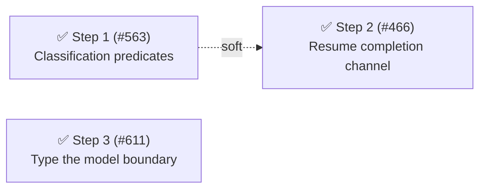

# Phase 21: Classification predicates, resume completion, model boundary

Phase 21 is a lean, three-step phase.
Discovery (2026-07-17: architecture-doc reading, issue sweep, fallow baseline, repeated-discriminator sweep, entry-point trace, craftsmanship scout) found the declared target architecture essentially complete: fallow reports 0 refactoring targets, 0 dead code, 0 duplication, and the craftsmanship scout refuted both fallow "giant test file" flags and found only scattered boy-scout polish.
Three cause-level Category C findings survived — two already filed as issues, one the explicitly deferred remainder of Phase 20 Step 4 — and they are the whole phase.
No polish step is manufactured to fill the ceiling; the scout's scattered findings (`mock.calls[N][idx]` indexing in the two lifecycle test suites, the `settings.ts` `sanitize()` range-check triplication, `createManager`'s nullish-coalescing density) are handed to the `tidy-first` boy-scout path.

## Health metrics

| Metric                                                            | Phase 20 (end) | Phase 21 target | Recompute                                                                                                             |
| ----------------------------------------------------------------- | -------------- | --------------- | --------------------------------------------------------------------------------------------------------------------- |
| Health score                                                      | 78/100 (B)     | ≥ 78 (B)        | `pnpm fallow health --score --workspace @gotgenes/pi-subagents`                                                       |
| Multi-status classification groupings outside `subagent-state.ts` | 11             | ≤ 2 → 2 ✅      | `grep -rEn 'status [!=]== "[a-z]+" (\|\||&&) ' packages/pi-subagents/src --include="*.ts" \| grep -vc subagent-state` |
| `model`/`parentModel` typed `unknown` in `src/`                   | 7              | 0 ✅            | `grep -rEn "model\??: unknown\|parentModel\??: unknown" packages/pi-subagents/src --include="*.ts" \| wc -l`          |
| Direct `this.mark*` calls inside `resume()`                       | 2              | 0               | `sed -n '/async resume(/,/^\t}/p' packages/pi-subagents/src/lifecycle/subagent.ts \| grep -c 'this\.mark'`            |
| Dead code / production duplication                                | 0 / 0          | 0 / 0           | `pnpm fallow dead-code --workspace @gotgenes/pi-subagents` / `pnpm fallow dupes --workspace @gotgenes/pi-subagents`   |

All three targeted metrics were confirmed delivered at archive time (recomputed 2026-07): the classification-grouping grep lands at 2, the `model`/`parentModel` `unknown` grep lands at 0, and the `resume()` `this.mark*` grep lands at 0.
The recomputed health score reproduces 78/100 (B) using the `--hotspots --targets` form (the bare `--score` form reports 88 A on this workspace — the two forms diverge, and 78 B is the form the baseline was computed with).

## ✅ Step 1 — Add classification predicates to `SubagentState` ([#563])

Cause: the state machine owns its six status transitions (design principle 9, "state owns its mutations") but not what a status _means_ — consumers re-derive the is-active (`running \|\| queued`), terminal-error (`error \|\| stopped \|\| aborted`), and steer/run-eligibility groupings at 11 sites across 8 files, so adding a status means finding every grouping and a missed one diverges silently.
Fallow is structurally blind to this smell (scattered one-line conditionals never form a token-run clone); the repeated-discriminator sweep is the detector, and it corroborates [#563]'s site list exactly.
Smell: Category C (repeated discriminator / anemic classification).
Target files: `src/lifecycle/subagent-state.ts` (instance predicates such as `isActive()` / `isTerminalError()` / `canBeSteered()`, plus exported status-level predicate functions for DTO consumers, with the instance predicates delegating so the module stays the single owner); consumers in `src/lifecycle/subagent.ts`, `src/lifecycle/subagent-manager.ts`, `src/tools/get-result-tool.ts`, `src/tools/background-spawner.ts`, `src/ui/widget-renderer.ts`, `src/ui/agent-widget.ts`, `src/ui/session-navigation.ts`, `src/observation/renderer.ts`, `src/observation/subagent-events-observer.ts`.
The per-status renderer arms (`result-renderer.ts`, `widget-renderer.ts` status→icon maps, `resolveStatusPresentation`) are legitimate presentation dispatch and stay.
Outcome: multi-status classification groupings outside `subagent-state.ts` drop 11 → ≤ 2 (any residual site is a single-status presentation or wait check, not a re-derived grouping).
Impact 3 / Risk 1 / Priority 15.

Landed: `isActiveStatus` / `isTerminalErrorStatus` / `isRunningStatus` are exported from `subagent-state.ts` as the single decision point; `SubagentState` (and the delegating `Subagent`) gained `isActive()` / `isTerminalError()` / `isRunning()` / `canBeSteered()`, both instance and status-level predicates delegating to the same functions.
Record holders (`subagent-manager.ts` ×4, `get-result-tool.ts`, `subagent.ts` `guardedRun`/`steer`/`abort`, `subagent-events-observer.ts`) call the instance methods; DTO holders (`widget-renderer.ts`, `renderer.ts`, `session-navigation.ts`) call the exported functions, with `NotificationDetails.status` and `WidgetAgent.status` tightened to `SubagentStatus`.
The three targeted groupings are gone outside `subagent-state.ts`; the grep lands at 2 (meets ≤ 2), both residuals being presentation/single-status the phase excludes — `result-renderer.ts`'s `completed \|\| steered` renderer arm and `get-result-tool.ts`'s `running` wait guard.

Release: independent

## ✅ Step 2 — Route resume termination through the completion channel ([#466])

Cause: dual completion channels — `Subagent.resume()` terminates via direct `markCompleted`/`markError` and never invokes `onRunFinished`, so the manager-level observer chain (public `subagents:completed`/`failed` events, `subagents:record` persistence, completion notification) never observes a resumed completion; completion signalling is fused to the _first_ run instead of owned by run termination generally.
This is a user-visible bug: after a resume, the persisted history shows the pre-resume result and external `SUBAGENT_EVENTS` subscribers never see the second finish.
Smell: Category C (coupling/boundary flaw), plus `bug`.
Design decision to resolve at `/plan-issue` time: a distinct resumed-completion event versus a `resumed: true` discriminator on the existing channels — the issue leans distinct-event because the once-per-session `session-created` → `disposed` child-lifecycle arc is load-bearing for pi-permission-system's registry bracket.
Invariant: do not perturb the child-lifecycle event ordering.
Target files: `src/lifecycle/subagent.ts` (share the termination path with `completeRun`/`failRun`), `src/lifecycle/subagent-session.ts` (`resumeTurnLoop` result shape), `src/observation/subagent-events-observer.ts`, `src/service/service.ts` (`SUBAGENT_EVENTS`, if a new channel is chosen), and this document's lifecycle-events table.
Soft-depends on Step 1: both edit `subagent.ts`'s status guards, and Step 1's predicates make the shared termination guard cleaner.
Outcome: direct `this.mark*` calls inside `resume()` drop 2 → 0; a resumed completion produces a notification, an updated persisted record, and a public event, each pinned by a regression test.
Impact 4 / Risk 2 / Priority 16.

Landed: the design decision resolved to a **distinct** `subagents:resumed` channel (single channel — the payload's `status`/`error` discriminate completed from error) and a **silent** child-lifecycle (no `subagents:child:*` on resume), so `subagent-session.ts` was untouched (`resumeTurnLoop` stays `Promise<string>`).
`Subagent.resume()` now routes through new `completeResume`/`failResume` methods (the two direct `this.mark*` calls in `resume()` are gone), which fire a new optional `SubagentLifecycleObserver.onResumeFinished`; `buildObserver()` maps it, background-gated, onto a new required `SubagentManagerObserver.onSubagentResumed`.
`SubagentEventsObserver.onSubagentResumed` emits `subagents:resumed` (via the shared `persistAndNotify` extracted from `onSubagentCompleted`) and re-appends `subagents:record`; the notification stays consumption-gated.
Regression tests pin the emit/append/notify chain, the observer wiring, and the background-only gate.

Release: independent

## ✅ Step 3 — Finish typing the model boundary ([#611])

Cause: the SDK model boundary is half-typed — Phase 20 Step 4 typed the resolver/tools layer against `Model<any>` but explicitly deferred the snapshot/session-assembly thread, leaving `model: unknown` at 7 sites, an `as Model<any>` cast in `src/runtime.ts`, and a `ctx.modelRegistry!` assertion in `src/lifecycle/parent-snapshot.ts`.
Feasibility probed against the real surface: `ExtensionContext.model: Model<any> \| undefined` and `ModelRegistry` are exported by `@earendil-works/pi-coding-agent` (`dist/core/extensions/types.d.ts`), and `src/session/model-resolver.ts` already imports `Model<any>` from `@earendil-works/pi-ai`.
Smell: Category C (platform type threading).
Target files: `src/lifecycle/parent-snapshot.ts`, `src/types.ts` (`SessionContext.model`), `src/session/session-config.ts`, `src/lifecycle/create-subagent-session.ts`, `src/runtime.ts`.
Outcome: `model`/`parentModel` `unknown` sites drop 7 → 0; the `runtime.ts` cast and the `parent-snapshot.ts` non-null assertion are removed.
Impact 3 / Risk 1 / Priority 15.

Landed: `SessionContext.model` / `ParentSnapshot.model` / `AssemblerContext.parentModel` / `AssemblerOptions.model` / `SessionConfig.model` and `resolveDefaultModel`'s parameter and return are typed against `Model<any>` (imported from `@earendil-works/pi-ai`); the `modelRegistry` fields on `SessionContext`, `ParentSnapshot`, `AssemblerContext`, and `CreateSessionOptions` are typed against the shared `ModelRegistry` (from `model-resolver`), collapsing the two duplicated inline structural types.
`SessionContext.modelRegistry` is now non-optional (matching the SDK's `ExtensionContext`), which let the `parent-snapshot.ts` `ctx.modelRegistry!` assertion and the `runtime.ts` `as Model<any>` cast both drop.
The recompute grep lands at 0.

Release: independent

## Step dependencies

## Parallel tracks

- **Track A — Tell-don't-ask:** Steps 1 → 2 (soft ordering; both edit `subagent.ts`).
- **Track B — SDK boundary:** Step 3 (fully independent).

## Release batches

- No batches; every step is independently releasable.
- Independently releasable: Steps 1, 2, 3.
- Step 2 lands as `fix:` — the phase's unhidden release vehicle; Steps 1 and 3 land as `refactor:` (hidden changelog types) and auto-batch into the next unhidden release.

## Deferred work (explicit dispositions, 2026-07-17)

- [#451] (CI/lint gate validating Mermaid diagrams with `mmdc`) — deferred with rationale: repo-level CI tooling, not pi-subagents structure; it does not belong to a package structural phase.
  Second consecutive sweep, so this is an explicit decision, not a silent re-defer.
- [#465], [#482], [#608] (feature requests) and [#519], [#600], [#610] (cross-package pi-permission-system tracks) — deferred with rationale: feature and cross-package work that does not gate this package's structural phase.
  Step 2 ([#466]) is a prerequisite for [#465]'s ask-back design, so landing this phase unblocks that track.
- Craftsmanship polish (scout inventory: `mock.calls[N][idx]` → `toHaveBeenCalledWith` in `test/lifecycle/subagent.test.ts` and `test/lifecycle/subagent-manager.test.ts`, `settings.ts` `sanitize()` range-check triplication, `createManager` fixture density, two `as any` private-state reaches) — deferred to the `tidy-first` boy-scout path; all clusters scored below the phase-step bar and the scout recommends incidental pickup.

[#451]: https://github.com/gotgenes/pi-packages/issues/451
[#465]: https://github.com/gotgenes/pi-packages/issues/465
[#466]: https://github.com/gotgenes/pi-packages/issues/466
[#482]: https://github.com/gotgenes/pi-packages/issues/482
[#519]: https://github.com/gotgenes/pi-packages/issues/519
[#563]: https://github.com/gotgenes/pi-packages/issues/563
[#600]: https://github.com/gotgenes/pi-packages/issues/600
[#608]: https://github.com/gotgenes/pi-packages/issues/608
[#610]: https://github.com/gotgenes/pi-packages/issues/610
[#611]: https://github.com/gotgenes/pi-packages/issues/611
